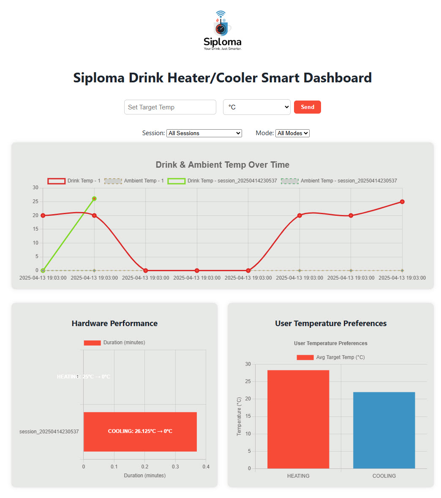
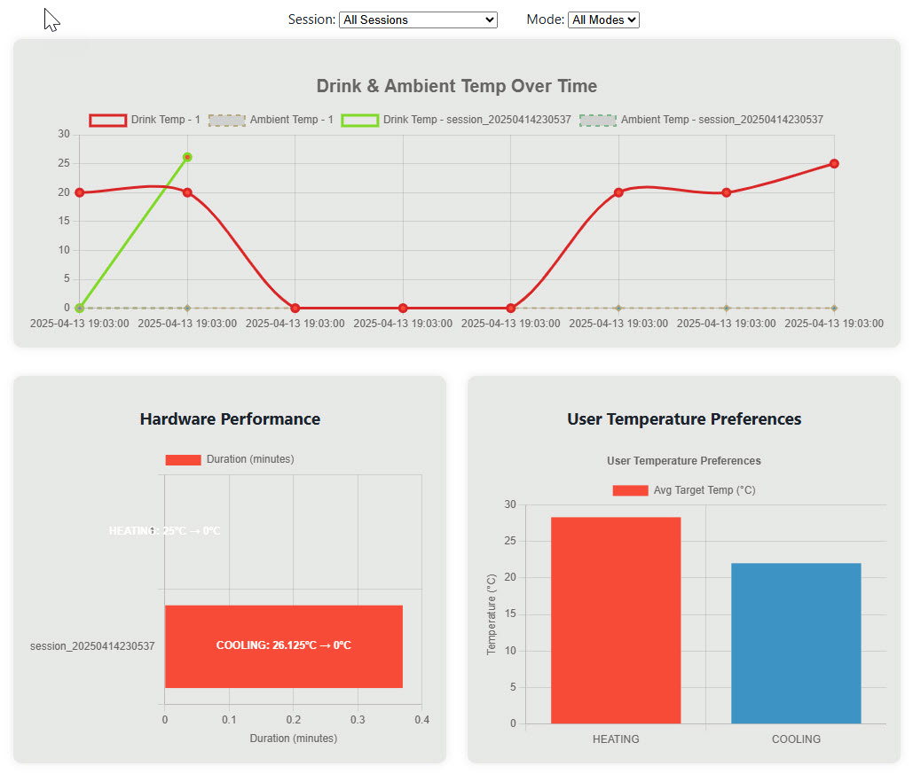

# Siploma Smart Drink Dashboard

The **Siploma Dashboard** is a responsive web interface that connects to a smart drink heating/cooling device. Users can set target beverage temperatures, view real-time and historical temperature data, and monitor device performance over time.

## Features

- **Live Temperature Control**  
  Set a target temperature in Celsius or Fahrenheit (with conversion) via the dashboard.

- **Session & Mode Filtering**  
  Filter data by session or mode (`HEATING` / `COOLING`) to isolate analytics.

- **Performance Visualization**  
  See how efficiently the device reached the target temperature in each session.

- **User Temperature Preferences**  
  Chart of average heating and cooling temperature preferences based on usage history.

- **Responsive Design**  
  Optimized for desktop and tablet viewing using modern HTML/CSS and Chart.js.

## Tech Stack

- **Frontend**: HTML, CSS, JavaScript (Vanilla)
- **Charts**: [Chart.js](https://www.chartjs.org/)
- **Backend**: Python (Flask)
- **Database**: MongoDB (Atlas)
- **MQTT**: AWS IoT Core (AWSIoTPythonSDK)

## Project Structure

```
siploma-smart/
├── dashboard/
│   ├── app.py                  # Flask app backend
│   ├── templates/
│   │   └── index.html          # Dashboard UI
│   ├── static/
│   │   ├── css/style.css       # Styling
│   │   └── js/main.js          # Chart logic and frontend interactivity
│   └── certs/                  # AWS IoT certificates (not committed)
├── src/
│   └── config.py               # Load environment variables
├── .env                        # Secrets and DB/MQTT config (not committed)
└── requirements.txt            # Python dependencies
```

## Getting Started

### 1. Clone the Repository

```bash
git clone https://github.ncsu.edu/juwujar/csc_591_spring2025_project.git
cd siploma-smart/dashboard
```

### 2. Set Up Virtual Environment

```bash
python -m venv venv
source venv/bin/activate  # On Windows: venv\Scripts\activate
```

### 3. Install Dependencies

```bash
pip install -r ../requirements.txt
```

### 4. Set Up Environment Variables
- Create a certs folder under the src folder
- Add the amazon certificates
- Rename the private key file to private.pem.key
- Rename the certificate file to certificate.pem
- Create a `.env` file in the root directory:

```ini
# AWS Config
AWS_ENDPOINT=a27w9tpjjy8cdi-ats.iot.us-east-1.amazonaws.com
MQTT_PORT=8883
TOPIC_USER_INPUT="siploma/user/input"
TOPIC_PERFORMANCE="siploma/performance"
CLIENT_ID=siploma_webapp
HARDWARE_CLIENT_ID=siploma_hardware
KEEPALIVE=60
CERT_PATH=src/certs/certificate.pem.crt
PRIVATE_KEY_PATH=src/certs/private.pem.key
ROOT_CA_PATH=src/certs/AmazonRootCA1.pem

# MongoDB Config (Flask/webapp settings)
DB_USER=web_app
DB_PASSWORD=Siplomawebapp
DB_CLUSTER=UserFrequency
DB_DATABASE=Simploma
DB_COLLECTION=Performance

MONGO_URI=mongodb+srv://<username>:<password>@cluster.mongodb.net/?retryWrites=true&w=majority # example

# Lambda-specific MongoDB settings
LAMBDA_DB_USER=aws_lambda
LAMBDA_DB_PASSWORD=Siplomalambdauser
LAMBDA_DB_DATABASE=Siploma
LAMBDA_DB_CLUSTER=UserFrequency
LAMBDA_DB_COLLECTION=UserInput
```

### 5. Run the Flask App

```bash
python -m dashboard.app
```

Visit `http://localhost:5000/` in your browser.

## Screenshots






## License

This project is licensed under the MIT License.

